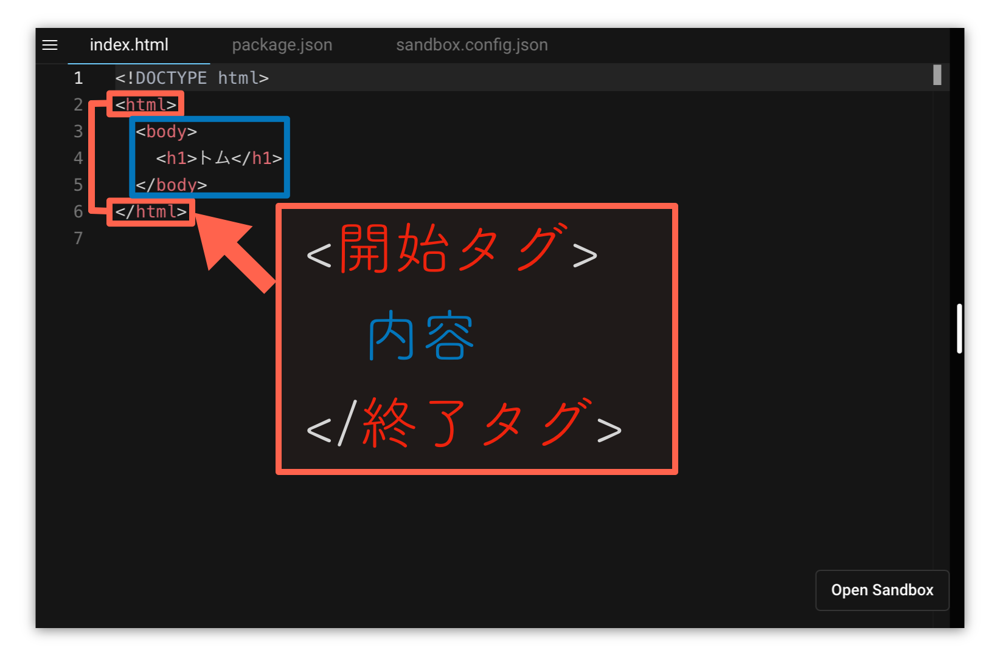
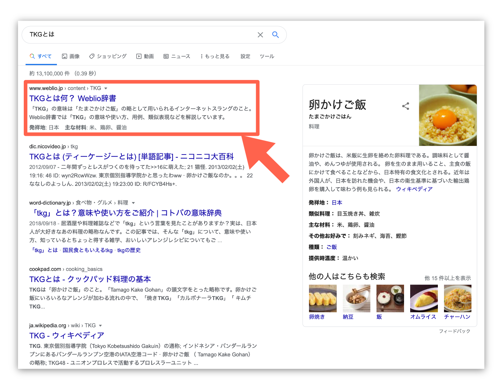

# HTMLで"構造"を書く

![][image-1]

まずは自分の名前を画面に表示してみよう。アレンはトムにそう言うと下のTemplateを作ってくれた。
Sandbox右下のOpen Sandboxをクリックして編集ページを開こう。

<iframe src="https://codesandbox.io/embed/01-01-01-znks3?fontsize=14&hidenavigation=1&theme=dark&view=split" style="width:100%; height:500px; border:0; border-radius: 4px; overflow:hidden;" title="01-01-01" allow="geolocation; microphone; camera; midi; vr; accelerometer; gyroscope; payment; ambient-light-sensor; encrypted-media; usb" sandbox="allow-modals allow-forms allow-popups allow-scripts allow-same-origin"></iframe>

これは`HTML[エイチ ティー エム エル]` を書いたCodeだ。WEBサイトはHTMLでできている。HTMLを書くことでWebサイトを作ることができる。

## Tagで挟み込む

HTMLは`Tag[タグ]`と呼ばれる文字で表示したい文章などを囲むことで文書を構造化する。

<div style="display: grid; grid-template-columns: repeat(2, 1fr); grid-template-areas: 'a b'; align-items: center;""\><div style="grid-area: a;">



</div><div style="grid-area: b;"><p>

開始Tagを書くと内容の始まりを表し、終了Tagを書くと内容が終わったことを示す。文章の意味ごとに複数のTagがある。Tagを覚えていくことで書ける内容が増えていく。

</p></div></div></div>

Tagは１行で書いても良いし、改行して複数行に書いても良い。

```html
<h1>トム</h1>
```

　↑どちらでも良い↓

```html
<h1>
トム
</h1>
```

実際に編集ページの内容を書き換えて表示を確かめてみよう。`h1[エイチ ワン]`タグは見出しを意味する`heading[ヘッディング]`の略である。hの後の数字の説明は後ほどする。

1. `>`と`ト`の間で`↩︎[エンター]`キーを押して改行する
2. `ム`と`<`の間で`↩︎[エンター]`キーを押して改行する

Codeは変わっているのに、表示されている内容には変化がないことがわかる。

<iframe src="https://codesandbox.io/embed/01-01-02-8boh9?fontsize=14&hidenavigation=1&theme=dark&view=split" style="width:100%; height:500px; border:0; border-radius: 4px; overflow:hidden;" title="01-01-01" allow="geolocation; microphone; camera; midi; vr; accelerometer; gyroscope; payment; ambient-light-sensor; encrypted-media; usb" sandbox="allow-modals allow-forms allow-popups allow-scripts allow-same-origin"></iframe>

## Tagの書き方に慣れよう

![][image-2]

Tagの詳しい勉強は後回しにして、まずはTagを書く練習をしよう。アレンはそう言うとトムのプロフィールを聞いた。

「Tokyo 在住。温泉巡り、犬が好き。」

アレンはトムの言ったことを要約すると画面に書き込んだ。

HTMLで文章を書く時は`<p>[ピー]`を使う。`Paragraph[パラグラフ]`の略で段落を意味する単語だ。このTagで文章を挟むことで文章の段落を作っていく。トムの名前の下にプロフィールを書いてみよう。

<iframe src="https://codesandbox.io/embed/01-01-03-z33nc?fontsize=14&hidenavigation=1&theme=dark&view=split" style="width:100%; height:500px; border:0; border-radius: 4px; overflow:hidden;" title="01-01-01" allow="geolocation; microphone; camera; midi; vr; accelerometer; gyroscope; payment; ambient-light-sensor; encrypted-media; usb" sandbox="allow-modals allow-forms allow-popups allow-scripts allow-same-origin"></iframe>

トムの名前の下にプロフィールが表示された。

![][image-3]

段落の中で改行をする時は`<br />[ビーアール]`を使う。改行を表す`Break[ブレイク]`の略である。これは一つで改行を表すTagなので`<タグ />`と書く。

<iframe src="https://codesandbox.io/embed/01-01-04-94mo3?fontsize=14&hidenavigation=1&theme=dark&view=split" style="width:100%; height:500px; border:0; border-radius: 4px; overflow:hidden;" title="01-01-01" allow="geolocation; microphone; camera; midi; vr; accelerometer; gyroscope; payment; ambient-light-sensor; encrypted-media; usb" sandbox="allow-modals allow-forms allow-popups allow-scripts allow-same-origin"></iframe>

箇条書きをする時は`<ul>[ユーエル]`と`<li>[エルアイ]`を使う。順序なし一覧という意味の`Unordered List[アンオーダード リスト]`の略と一覧の項目という意味の`List Item[リスト アイテム]`の略になる。

<iframe src="https://codesandbox.io/embed/01-01-05-3u3mo?fontsize=14&hidenavigation=1&theme=dark&view=split" style="width:100%; height:500px; border:0; border-radius: 4px; overflow:hidden;" title="01-01-01" allow="geolocation; microphone; camera; midi; vr; accelerometer; gyroscope; payment; ambient-light-sensor; encrypted-media; usb" sandbox="allow-modals allow-forms allow-popups allow-scripts allow-same-origin"></iframe>

`<ul>`を`<ol>[オーエル]（Ordered List[オーダード リスト]）`に書き換えることで下のように順序付きの箇条書きを書くこともできる。

<iframe src="https://codesandbox.io/embed/01-01-06-5sgkg?fontsize=14&hidenavigation=1&theme=dark&view=split" style="width:100%; height:500px; border:0; border-radius: 4px; overflow:hidden;" title="01-01-01" allow="geolocation; microphone; camera; midi; vr; accelerometer; gyroscope; payment; ambient-light-sensor; encrypted-media; usb" sandbox="allow-modals allow-forms allow-popups allow-scripts allow-same-origin"></iframe>

見出し、段落、改行、箇条書きはどれも文書作成ソフトのWordで聞いたことのある単語だと思う。Wordではボタンを押すだけで簡単にできるのになぜ文字で全て書かないといけないHTMLとCSSを学ぶ必要があるのかって思うかな。それはこの先に続く内容を知れば分かってくる。ひとまず進めていこう。
その前に一つ一つの要素がどのような意味を持ち、見た目を変更できるのか学んでいこう。

## なぜ構造化する必要があるのか

<div style="display: grid; grid-template-columns: repeat(2, 1fr); grid-template-areas: 'a b'; align-items: center;""\><div style="grid-area: a;">



</div><div style="grid-area: b;"><p>

検索画面を見てほしい。検索結果にはWEBサイトの一部のみしか表示されていない。WEBサイトの中のタイトルや見出しをコンピュータが自動で抜き出して表示している。コンピュータにWEBサイトの内容を理解してもらうために構造化する必要がある。

</p></div></div></div>

## WEBはHyperな技術？

ページを移動する時にクリックする`Link[リンク]`も`Hyper Link[ハイパー リンク]`と呼んだりする。Webはハイパーな技術でできている。

[image-1]:	../images/01-01-html.png
[image-2]:	../images/01-04-about-tom.png
[image-3]:	../images/00-05-favorite-spring.png